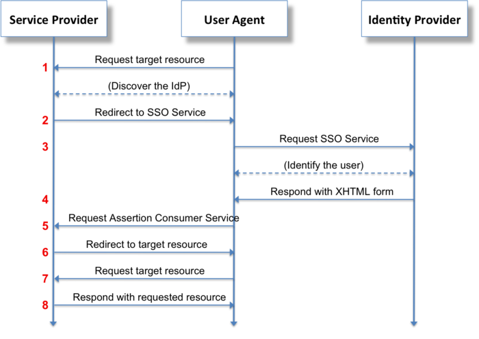

<!-- <p align="center">
  <a href="http://nestjs.com/" target="blank"></a>
</p>

[circleci-image]: https://img.shields.io/circleci/build/github/nestjs/nest/master?token=abc123def456
[circleci-url]: https://circleci.com/gh/nestjs/nest -->

 


## Flow Example

<p align="left">
  
  
  
## Saml Example code

  


  
  
  ```js
<saml:Assertion
   xmlns:saml="urn:oasis:names:tc:SAML:2.0:assertion"
   xmlns:xs="http://www.w3.org/2001/XMLSchema"
   ID="_d71a3a8e9fcc45c9e9d248ef7049393fc8f04e5f75"
   Version="2.0"
   IssueInstant="2004-12-05T09:22:05Z">
   <saml:Issuer>https://idp.example.org/SAML2</saml:Issuer>
   <ds:Signature
     xmlns:ds="http://www.w3.org/2000/09/xmldsig#">...</ds:Signature>
   <saml:Subject>
     <saml:NameID
       Format="urn:oasis:names:tc:SAML:2.0:nameid-format:transient">
       3f7b3dcf-1674-4ecd-92c8-1544f346baf8
     </saml:NameID>
     <saml:SubjectConfirmation
       Method="urn:oasis:names:tc:SAML:2.0:cm:bearer">
       <saml:SubjectConfirmationData
         InResponseTo="aaf23196-1773-2113-474a-fe114412ab72"
         Recipient="https://sp.example.com/SAML2/SSO/POST"
         NotOnOrAfter="2004-12-05T09:27:05Z"/>
     </saml:SubjectConfirmation>
   </saml:Subject>
   <saml:Conditions
     NotBefore="2004-12-05T09:17:05Z"
     NotOnOrAfter="2004-12-05T09:27:05Z">
     <saml:AudienceRestriction>
       <saml:Audience>https://sp.example.com/SAML2</saml:Audience>
     </saml:AudienceRestriction>
   </saml:Conditions>
   <saml:AuthnStatement
     AuthnInstant="2004-12-05T09:22:00Z"
     SessionIndex="b07b804c-7c29-ea16-7300-4f3d6f7928ac">
     <saml:AuthnContext>
       <saml:AuthnContextClassRef>
         urn:oasis:names:tc:SAML:2.0:ac:classes:PasswordProtectedTransport
       </saml:AuthnContextClassRef>
     </saml:AuthnContext>
   </saml:AuthnStatement>
   <saml:AttributeStatement>
     <saml:Attribute
       xmlns:x500="urn:oasis:names:tc:SAML:2.0:profiles:attribute:X500"
       x500:Encoding="LDAP"
       NameFormat="urn:oasis:names:tc:SAML:2.0:attrname-format:uri"
       Name="urn:oid:1.3.6.1.4.1.5923.1.1.1.1"
       FriendlyName="eduPersonAffiliation">
       <saml:AttributeValue
         xsi:type="xs:string">member</saml:AttributeValue>
       <saml:AttributeValue
         xsi:type="xs:string">staff</saml:AttributeValue>
     </saml:Attribute>
   </saml:AttributeStatement>
 </saml:Assertion>


```
  


## Installation

```bash
$ yarn
```

## Running the app

```bash
# development

# watch mode
$ yarn start:dev

# production mode
$ yarn start:prod
```

## Docker

```bash
# cd db_local
$ docker-compose up

```


